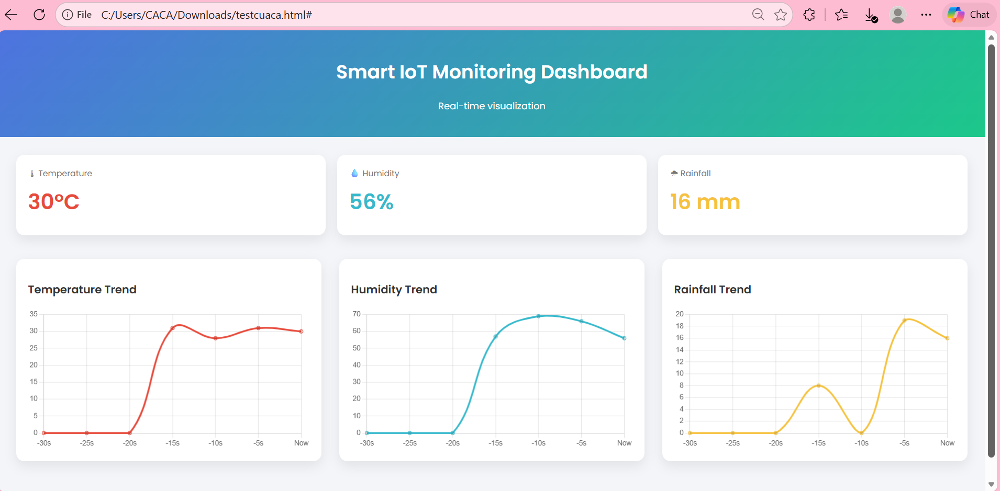
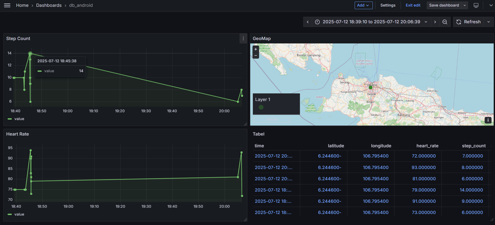
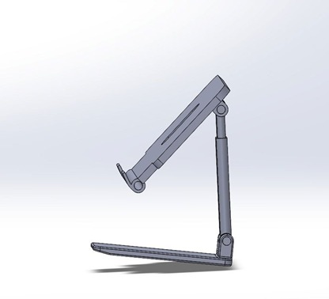
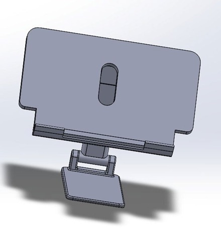
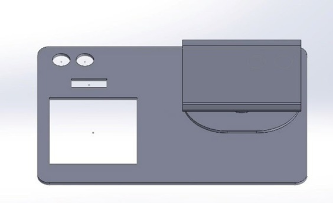
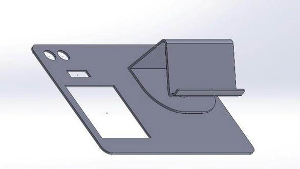
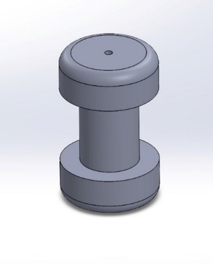

# 👩‍💻 Zahwa Anisya Fatimah Az-Zahra – Portofolio

## 📌 About Me
Computer Technology graduate passionate about **IoT systems, Wear OS UI/UX, data monitoring dashboards, and product-oriented solutions**.  
Experienced in designing, prototyping, and documenting technology projects with real-world applications. Familiar with Agile work processes, cross-functional collaboration, and continuous improvement.

## 🛠 Skills
**Languages & Platforms**  
- HTML • SQL • Kotlin (basic) • C++

**IoT & Embedded**  
- ESP32 • Sensor integration • PCB design basics

**Mobile & UI/UX**  
- Android Studio • Wear OS • Figma

**Data & Visualization**  
- Grafana • MySQL • Dashboard design

**Tools & Workflow**  
- Jira • SolidWorks • YouTrack • Git • Agile methodology 

## 📂 Projects

### 🟦 Wear OS Driver Monitoring (UI/UX Prototype)
**Description:**  
A Wear OS interface designed to monitor driver conditions with high readability and simplicity for small-screen devices.

**Highlights**
- Focus on **UI/UX clarity** and interaction flow  
- Designed with **Wear OS constraints** in mind

**Tech Stack**  
Android Studio • Wear OS • Figma

**Role**  
UI design, prototype flow, usability evaluation

### 🟧 IoT Weather Monitoring System
**Description:**  
An IoT weather monitoring solution using ESP32 and rain sensor modules to collect and display rainfall data for analysis.

**Highlights**
- Real-time sensor data collection  
- Hardware–software integration

**Tech Stack**  
ESP32 • Arduino IDE

**Role**  
Sensor integration, system setup, data collection

### 🟩 Sensor Dashboard Visualization (Grafana)
**Description:**  
A monitoring dashboard built to visualize real-time sensor data for analysis and decision support.

**Highlights**
- Data aggregation and visualization  
- User-friendly panels and monitoring layout

**Tech Stack**  
Grafana • MySQL

**Role**  
Dashboard design, data structuring

🟥 3D Tablet Stand Design

**Description:**
A 3D tablet stand designed as a stable holder for display and demonstration purposes. The structure is optimized for strength, balance, and compatibility with 3D-printing processes.

**Highlights**
-Ergonomic support for tablet devices
-Stable base and reinforced structure
-Printable using common 3D-printer materials

**Tools Used**
SolidWorks

🟫 Display Box – Bottom Section Components (in progress)

**Description:**
Design of the lower part of a display box used to organize electronic components and provide structural support.

**Highlights**
-Organized internal component placement
-Improved maintenance accessibility
-Modular and repair-friendly structure

**Tools Used**
SolidWorks

🟪 Acrylic Holder Design

**Description:**
Acrylic holder designed to securely support acrylic panels in display systems. The model focuses on dimensional accuracy and ease of assembly.

**Highlights**
-Precision fit for acrylic sheets
-Simple and modular assembly
-Compatible with laser-cut or 3D-printed fabrication

**Tools Used**
SolidWorks

## 🎓 Education
**Diploma (D3) in Computer Technology**  
Telkom University – Bandung  
GPA: 3.53

## 📫 Contact
📧 Email: zahwanis440@gmail.com  
🔗 LinkedIn: https://www.linkedin.com/in/zahwa-anisya-fatimah-az-zahra-02722b31a  
🔗 GitHub: https://github.com/ZahwaAnisya
